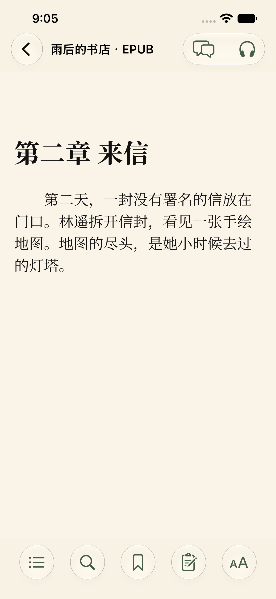
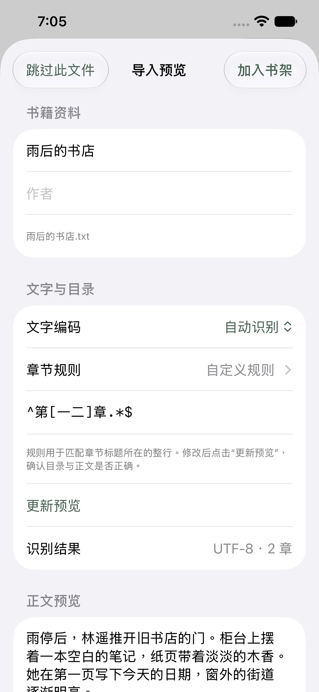
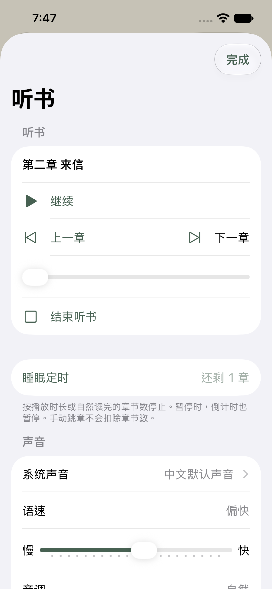

# 墨知 MoRead · iOS

面向 iPhone 和 iPad 的本地阅读器，基于 [MoRead](https://github.com/ovo066/MoRead) 的功能与数据规则移植。

当前为开发中的版本，最低支持 iOS 17。

- TXT、EPUB 导入，章节目录、书内搜索、书签与阅读进度保存。
- TXT 导入前预览正文和目录，可选文字编码、内置或自定义章节规则。
- 多级分组、合集和彩色标签，组合筛选、拖动排序与批量归类。
- 字号、行距、纸张配色，以及荧光、下划线和波浪线批注。
- 系统连续听书、当前文字高亮、锁屏播放控制，声音搜索与试听，保存语速和音调。
- OpenAI 兼容、MiniMax 和 GMI 云端听书，连续播放、按声音参数复用本机音频及缓存空间管理。
- 按播放分钟数或自然读完章节数的睡眠定时，暂停时暂停计时，支持章节切换和章内定位。
- 自填服务商地址、模型与密钥，支持 OpenAI 兼容、Responses、Claude、Gemini 四种聊天接口。
- SillyTavern JSON、PNG 角色卡与世界书，流式伴读、对话分支、原文引用和已读范围限制。
- 按书开启向量原文记忆，已读章节断点续传，按意思检索并核对原文位置。
- 完整本地备份、恢复前校验、恢复内容预览和撤销上次恢复。
- 按书查看存储占用，清理正文后保留阅读记录、笔记和伴读话题。

书籍和对话保存在设备中，服务商密钥保存在系统钥匙串。发送伴读消息时，所选服务商会收到角色资料、近期对话和检索到的已读原文。角色设定不能保证模型绝不剧透；原文检索按本地阅读边界截断。向量记忆在「设置 → 向量记忆」中单独选择 OpenAI 兼容或 Gemini 服务商及向量模型，按书开启后，会将已读片段与检索问题发送给该服务商。索引保存在本机，可停止整理、单独清理，并随完整备份恢复。

云端声音在「设置 → 云端声音与缓存」中配置。开启后，朗读片段会发送给所选语音服务商，并按其规则计费；已生成音频保存在本机，纳入完整备份。缓存达到设置上限时，先清理最久没有播放的音频。

   

## 开发

双击 `MoRead.xcodeproj`，在 Xcode 中打开工程并等待组件下载完成。顶部选择 `MoRead` 和一个 iPhone 模拟器，再点击三角形运行按钮。

安装到自己的 iPhone：

1. 在 Mac 打开 Xcode，完成首次启动设置，并在 Xcode 的 Settings → Accounts 中登录 Apple 账户。
2. 用数据线连接 iPhone，按手机提示信任这台 Mac。
3. 在工程左侧点击蓝色 `MoRead` 图标，选择 TARGETS 下的 `MoRead`，打开 Signing & Capabilities，在 Team 中选择自己的账户。
4. 在 Xcode 顶部设备列表选择这台 iPhone，点击三角形运行按钮。若手机要求启用“开发者模式”，按设备提示完成后再运行。

核心检查使用 `swift test`。`project.yml` 是工程配置，修改它后用 XcodeGen 执行 `xcodegen generate`。GitHub Actions 会构建 iPhone 应用，并在模拟器中检查 TXT 与 EPUB 阅读及重启后的进度恢复。语音接口检查使用固定响应样本，模拟器用本地测试音频验证播放、暂停、跳章和章节定时。真实服务商连接及真机锁屏播放需另行验收。云端产物未经个人账户签名，不能直接安装到手机。

## 来源与许可

本项目基于 [DataDeletionAZA/MoRead](https://github.com/DataDeletionAZA/MoRead)，参考版本 `2421731e4e29fc081b28cd7f89e2566095cc6513`。

按 [GPL-3.0](LICENSE) 发布，第三方来源见 [THIRD_PARTY_NOTICES.md](THIRD_PARTY_NOTICES.md)。
